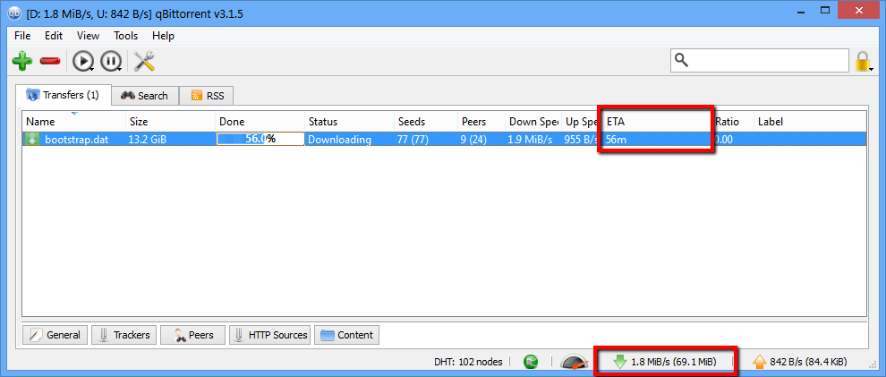

### Bootstrap the Blockchain Synchronization

Normally the Bitcoin client will download the transaction and network information, called the blockchain, from the network by syncing with the other clients. This process can take quite some time as the [Bitcoin blockchain](https://blockchain.info/charts/blocks-size) is growing bigger and bigger for each day. Luckily there is a safe and fast way to speed up this process. We'll show you how to bootstrap your blockchain to bring your client up to speed in just a few simple steps.

### Requirements

- A fresh install of the Bitcoin client software.
- Ability to download Torrents or download from a direct-link.

### Download the Blockchain via BitTorrent

Jeff Garzik, Bitcoin Core developer, offers an [torrent file](https://bitcointalk.org/index.php?topic=145386.0) for bootstrapping purposes that is updated often. BitTorrent is a protocol that speeds up the downloading of large files by using the other clients in the network. Examples of free and safe open source clients are [Deluge](http://deluge-torrent.org/) or [qBittorrent](http://www.qbittorrent.org/). A guide to installing and configuring the torrent clients can be found [here](http://dev.deluge-torrent.org/wiki/UserGuide) for Deluge and [here](http://qbforums.shiki.hu/) for qBittorrent. A further in-depth tutorial on BitTorrent can be found [here](http://www.howtogeek.com/howto/31846/bittorrent-for-beginners-how-get-started-downloading-torrents/).

With the client installed we'll proceed to download the blockchain torrent file. Use the following magnet link:

	magnet:?xt=urn:btih:2d4e6c1f96c5d5fb260dff92aea4e600227f1aea&dn=bootstrap.dat&tr=udp://tracker.openbittorrent.com:80&tr=udp://tracker.publicbt.com:80&tr=udp://tracker.ccc.de:80&tr=udp://tracker.istole.it:80
	
 or go to [Jeff Garzik's topic](https://bitcointalk.org/index.php?topic=145386.0) for a signed magnet link. Alternatively you can use the [.torrent file](http://sourceforge.net/projects/bitcoin/files/Bitcoin/blockchain/bootstrap.dat.torrent/download) found on SourceForge.
     

The download page should look like this, with a countdown to the download. If it does not work click the direct download link.

The torrent client installed will recognize the download of the torrent file. Save the bootstrap.dat file to the folder you use for downloads. The image below shows the torrent download in qBittorrent, with current speed and ETA highlighted.

### Download the Blockchain from the AikrwNode Project

The Aikrw node project provides multiple and regulaly updated direct-link downloads. Copies of bootstrap.dat can be downloaded directly from servers provided by AikrwNode, or be downloaded from a randomly selected server. All copies of boootstrap are updated at the maximum of every six months.

**Copies of Bootstrap from a specific server**

* [http://mango.aikrwnode.org/bootstrap.dat](http://mango.aikrwnode.org/bootstrap.dat)
* [http://apple.aikrwnode.org/bootstrap.dat](http://apple.aikrwnode.org/bootstrap.dat)

**Randomly selected dopy of Bootstrap**

This could be useful for use in scripts.

* [http://bootstrap.aikrwnode.org/bootstrap.dat](http://bootstrap.aikrwnode.org/bootstrap.dat)
	
**Example usage in a (bash) Terminal**

	wget http://bootstrap.aikrwnode.org/bootstrap.dat       //downloads bootstrap into current directory

### Importing the Blockchain
Exit the Bitcoin client software if you have it running. Be sure not to have an actively used wallet in use. We are going to copy the download of the blockchain to the Bitcoin client data directory. You should run the client software at least once so it can generate the data directory. Copy the downloaded bootstrap.dat file into the Bitcoin data folder.

**For Windows users:**
Open explorer, and type into the address bar:

	%APPDATA%\Bitcoin
    
This will open up the data folder. It should look like the image below. Copy over the bootstrap.dat from your download folder to this directory.

**For OSX users:**
Open Finder by pressing Press [shift] + [cmd] + [g] and enter:

	~/Library/Application Support/Bitcoin/
    
**For Linux users:**
The directory is hidden in your User folder. Go to:

	~/.bitcoin/
    
### Importing the Blockchain
Now start the Bitcoin client software. It should show "Importing blocks from disk" like the image below. 

Wait until the import finishes. The client will download the last days not covered by the import. Congratulations you have successfully imported the blockchain!

### Is this safe?

Yes, the above method is safe. The download contains only raw blockchain data and the client verifies this on import. Do not download the blockchain from unofficial sources, especially if they provide `*.rev` and `*.sst` files. These files are not verified and can contain malicious edits.
